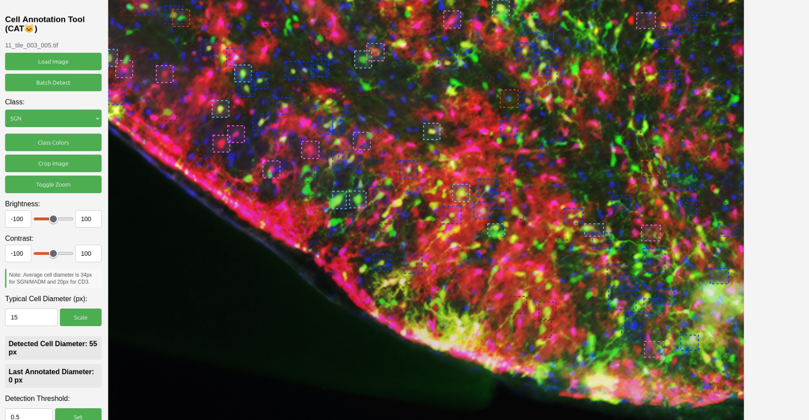

# **Cell Annotation Tool (CAT) 🐱**

A web-based GUI for streamlined object detection and annotation in microscopy images, designed for biologists and researchers with minimal programming experience.



---

## **🎯 Overview**

The **Cell Annotation Tool (CAT)** simplifies the process of labeling microscopy images by combining the power of the **YOLOv11 (Ultralytics)** model with an intuitive user interface. Built with **Flask** and **JavaScript**, CAT allows users to perform automated cell detection, manually refine annotations, and export data for model fine-tuning.

The tool is specifically designed for SGN, MADM, and CD3 cell types but can be adapted for other object detection tasks.

---

## **✨ Features**

* **🧠 Model Management:** Upload, test, and compare custom YOLO models against baselines. Fine-tune models directly in the app using your newly annotated data.
* **👥 Multi-user Support:** Concurrent user sessions are supported, with isolated data directories for each user to prevent data conflicts.
* **📦 Data Export:** Easily export your complete annotated dataset as a `.zip` archive, perfectly formatted for YOLO training.
* **🎨 Visualization & Customization:** Adjust bounding box colors, image brightness/contrast, and the model's detection threshold on the fly.
* **🖼️ Image Handling:** Full support for zooming, cropping, and scaling. The tool also automatically converts high-resolution `.tiff` images to web-friendly `.png` format.

---

## **🚀 Getting Started**

Follow these instructions to get a local copy up and running.

### **Prerequisites**

You must have **Conda** installed on your system. We recommend [Miniconda](https://docs.conda.io/en/latest/miniconda.html) for a lightweight installation.

### **Installation**

1.  **Clone the repository:**
    ```bash
    git clone [https://github.com/your-username/your-repository.git](https://github.com/your-username/your-repository.git)
    cd your-repository
    ```

2.  **Create the Conda environment:**
    The `environment.yml` file contains all the necessary dependencies. This single command sets up everything you need.
    ```bash
    # This will create an environment named 'cat_env'
    conda env create -f environment.yml
    ```

---

## **▶️ Usage**

### **Running the Application**

1.  **Activate the environment:**
    **Note:** You must run this command every time you open a new terminal to work on the project.
    ```bash
    conda activate cat_env
    ```

2.  **Launch the Flask application:**
    ```bash
    python app.py
    ```

The application will start on port **5001**. You can access it in your web browser at one of the following URLs:

* **Local Machine:** `http://localhost:5001/static/index.html`
* **Internal Server:** `http://<YOUR_SERVER_IP>:5001/static/index.html`

> **Note:** The web interface is only available while the `app.py` script is running.

### **Step-by-Step Workflow**

1.  **Upload** an image to begin.
2.  **Adjust** image settings (zoom, brightness, etc.) as needed for clarity.
3.  **Run Detection** using a pre-loaded or custom model.
4.  **Edit Annotations:**
    * **Add:** Click and drag to draw a new bounding box.
    * **Remove:** Right-click an existing box.
5.  **Save Data** to store the updated image and its annotations for later use.
6.  **Fine-tune Model** using all the data you've saved. A new `.pt` model file will be generated for download.
7.  **Test** your new model using the "Custom Detect" feature.
