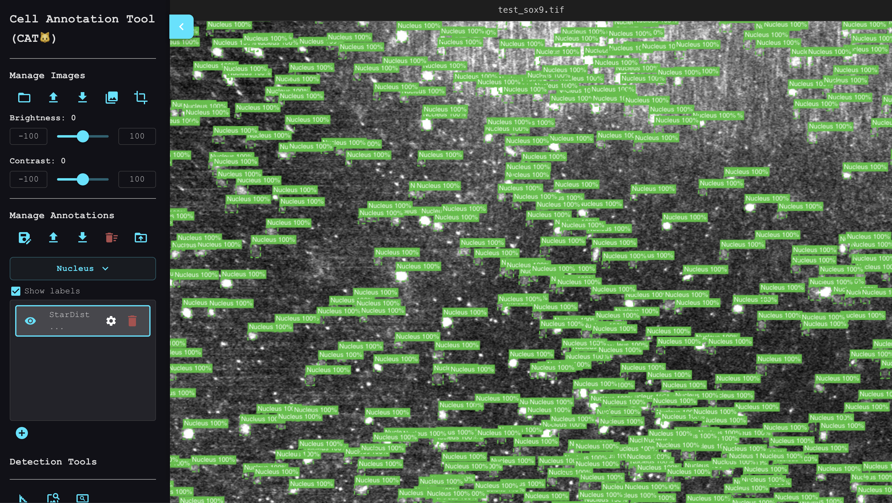
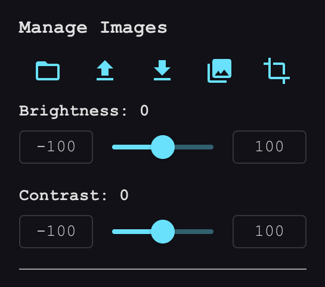
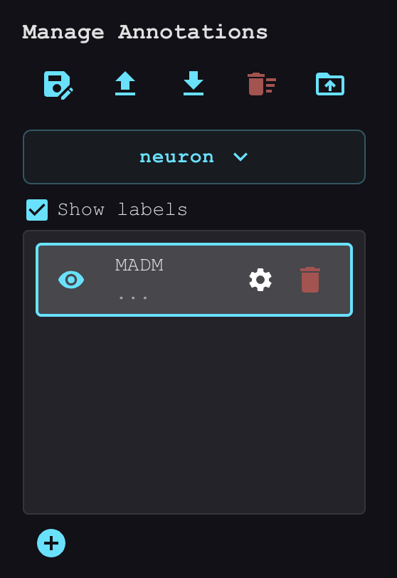
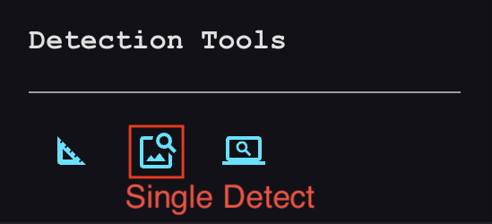

# **Cell Annotation Tool (CAT) 🐱**

A web-based GUI for streamlined object detection and annotation in microscopy images, designed for biologists and researchers with minimal programming experience.



---

## **🎯 Overview**

The **Cell Annotation Tool (CAT)** simplifies the process of labeling microscopy images by combining the power of the **YOLOv11 (Ultralytics)** model with an intuitive user interface. Built with **Flask** and **JavaScript**, CAT allows users to perform automated cell detection, manually refine annotations, and export data for model fine-tuning.

The tool is specifically designed for SGN, MADM, and CD3 cell types but can be adapted for other object detection tasks.

---

## **✨ Features**

* **🧠 Model Management:** Upload, test, and compare custom YOLO models against baselines. Fine-tune models directly in the app using your newly annotated data.
* **👥 Multi-user Support:** Concurrent user sessions are supported, with isolated data directories for each user to prevent data conflicts.
* **📦 Data Export:** Easily export your complete annotated dataset as a `.zip` archive, perfectly formatted for YOLO training.
* **🎨 Visualization & Customization:** Adjust bounding box colors, image brightness/contrast, and the model's detection threshold on the fly.
* **🖼️ Image Handling:** Full support for zooming, cropping, and scaling. The tool also automatically converts high-resolution `.tiff` images to web-friendly `.png` format.

---

## **📘 User Guide**

### **Logging In**

When first opening the application, a log in prompt will appear at the top of the screen. You must be logged in in order to save your work and access it later. If you already have an account, log in with your credentials. Otherwise, choose a username and choose "register".

### **Uploading Images**

To upload images, select "upload images" under the section "Manage Images" in the menu on the left hand side of the screen. Then, select the image or images that you would like to upload. If you are uploading multiple images at once, you will be asked if you would like to create an image set using the selected images. If you choose to do so, you will then be prompted for a name for the set.



### **Running Detection Models**

To run a detection model on an image, you must first set the detection settings. To do this, go to the section "Manage Annotations" and select "Add New Item" (see image). This will create a new row for detection settings. You can then edit the options for this row, including the model, classes, row label, and other detection settings.



Once the settings are selected, to execute detection, go to "Detection Tools" and select "Single Detect".



### **Annotating Images**

You can directly draw annotations onto uploaded images. Use the class selector under "Manage Annotation" in order to choose which class to draw an annotation for. To draw an annotation, hold down left click on the image canvas and drag until the annotation is the size that you want it to be, then release. To delete an annotation, hold shift and left click it. To undo an addition or deletion, press ctrl and z. Use the scroll wheel or trackpad to zoom in and out, and right click to pan your view across the image.

## **🛠️ Dev Guide**

Follow these instructions to get a local copy up and running.

### **Prerequisites**

You must have **Conda** installed on your system. We recommend [Miniconda](https://docs.conda.io/en/latest/miniconda.html) for a lightweight installation.

### **Installation**

1.  **Clone the repository:**
    ```bash
    git clone https://github.com/reubenrosenNCSU/cellannotationYOLO.git
    cd cellannotationYOLO
    ```

2.  **Create the Conda environment:**
    This command reads the `environment.yml` file to create an environment named **`cellv2`** and install all required dependencies.
    ```bash
    conda env create -f environment.yml
    ```
### **Running the Application**

1.  **Activate the environment:**
    **Note:** You must run this command every time you open a new terminal to work on the project.
    ```bash
    conda activate cellv2
    ```

2.  **Launch the Flask application:**
    ```bash
    cd backend
    python app.py
    ```

3. **Launch the React Application:**
   ```bash
    cd frontend
    npm start
    ```

The application will start on port **5001**. You can access it in your web browser at one of the following URLs:

* **Local Machine:** `http://localhost:3000`
* **Internal Server:** `http://<YOUR_SERVER_IP>:3000`

> **Note:** The web interface will only be able to access user data and most app functionality while app.py is running
