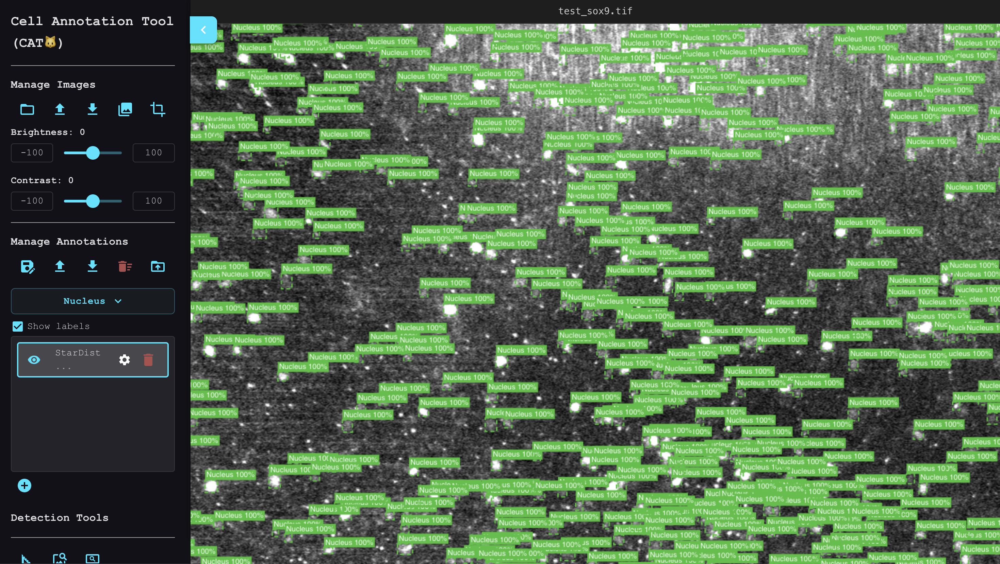
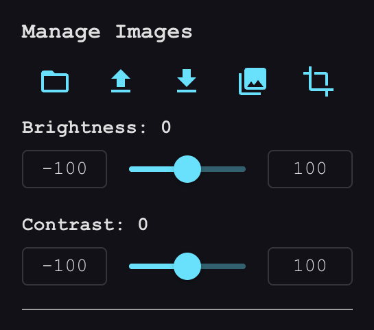
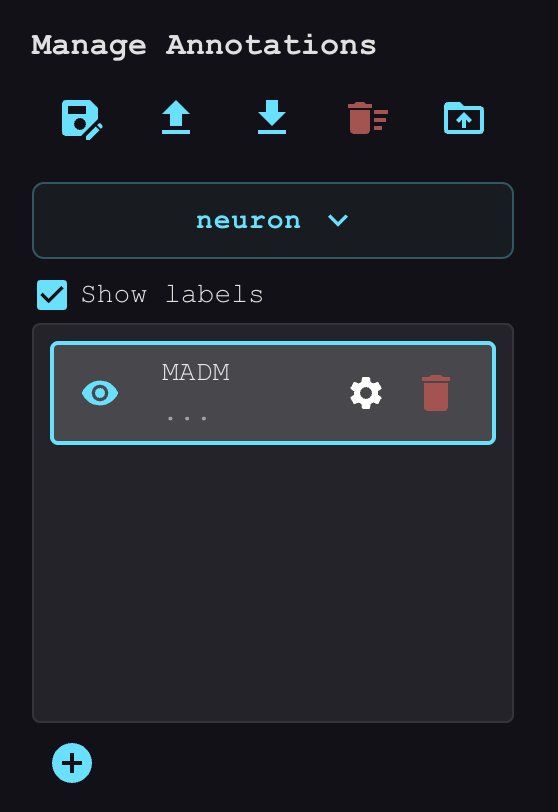
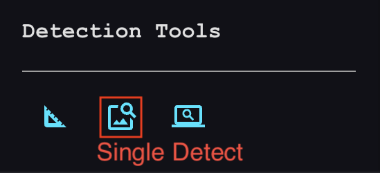

# **Cell Annotation Tool (CAT) 🐱**

A web-based GUI for streamlined object detection and annotation in microscopy images, designed for biologists and researchers with minimal programming experience.



---

## **🎯 Overview**

The **Cell Annotation Tool (CAT)** simplifies the process of labeling microscopy images by combining the power of the **YOLOv11 (Ultralytics)** model with an intuitive user interface. Built with **Flask** and **JavaScript**, CAT allows users to perform automated cell detection, manually refine annotations, and export data for model fine-tuning.

The tool is specifically designed for SGN, MADM, and CD3 cell types but can be adapted for other object detection tasks.

---

## **✨ Features**

* **🧠 Model Management:** Upload, test, and compare custom YOLO models against baselines. Fine-tune models directly in the app using your newly annotated data.
* **👥 Multi-user Support:** Concurrent user sessions are supported, with isolated data directories for each user to prevent data conflicts.
* **📦 Data Export:** Easily export your complete annotated dataset as a `.zip` archive, perfectly formatted for YOLO training.
* **🎨 Visualization & Customization:** Adjust bounding box colors, image brightness/contrast, and the model's detection threshold on the fly.
* **🖼️ Image Handling:** Full support for zooming, cropping, and scaling. The tool also automatically converts high-resolution `.tiff` images to web-friendly `.png` format.

---

## **📘 User Guide**

### **Logging In**

When first opening the application, a log in prompt will appear at the top of the screen. You must be logged in in order to save your work and access it later. If you already have an account, log in with your credentials. Otherwise, choose a username and choose "register".

### **Uploading Images**

To upload images, select "upload images" under the section "Manage Images" in the menu on the left hand side of the screen. Then, select the image or images that you would like to upload. If you are uploading multiple images at once, you will be asked if you would like to create an image set using the selected images. If you choose to do so, you will then be prompted for a name for the set.



### **Running Detection Models**

To run a detection model on an image, you must first set the detection settings. To do this, go to the section "Manage Annotations" and select "Add New Item" (see image). This will create a new row for detection settings. You can then edit the options for this row, including the model, classes, row label, and other detection settings.



Once the settings are selected, to execute detection, go to "Detection Tools" and select "Single Detect".



### **Annotating Images**

You can directly draw annotations onto uploaded images. Use the class selector under "Manage Annotation" in order to choose which class to draw an annotation for. To draw an annotation, hold down left click on the image canvas and drag until the annotation is the size that you want it to be, then release. To delete an annotation, hold shift and left click it. To undo an addition or deletion, press ctrl and z. Use the scroll wheel or trackpad to zoom in and out, and right click to pan your view across the image.

## **🛠️ Dev Guide**

Follow these instructions to get a local copy up and running.

### **Prerequisites**

You must have **Conda** installed on your system. We recommend [Miniconda](https://docs.conda.io/en/latest/miniconda.html) for a lightweight installation.

### **Installation**

1.  **Clone the repository:**
    ```bash
    git clone https://github.com/reubenrosenNCSU/cellannotationYOLO.git
    cd cellannotationYOLO
    ```

2.  **Create the Conda environment:**
    This command reads the `environment.yml` file to create an environment named **`cellv2`** and install all required dependencies.
    ```bash
    conda env create -f environment.yml
    ```
### **Running the Application**

1.  **Activate the environment:**
    **Note:** You must run this command every time you open a new terminal to work on the project.
    ```bash
    conda activate cellv2
    ```

2.  **Launch the Flask application:**
    ```bash
    cd backend
    python app.py
    ```

3. **Launch the React Application:**
   ```bash
    cd frontend
    npm start
    ```

The application will start on port **5001**. You can access it in your web browser at one of the following URLs:

* **Local Machine:** `http://localhost:3000`
* **Internal Server:** `http://<YOUR_SERVER_IP>:3000`

> **Note:** The web interface will only be able to access user data and most app functionality while app.py is running

## Annotation export contract

Exports from the React/backend application now return a ZIP for both individual
images and image sets. Each image includes a `<image-id>.metadata.json` sidecar.
Text filenames use stable image/annotation IDs to avoid collisions between images,
channels, or settings with identical names; human-readable names are in metadata.

Every exported TXT row starts with a separate channel column (`C1`, `C2`, `C3`, etc.),
using the UI channel order plus one. Metadata maps these labels to channel names
and IDs; a number does not imply an RGB color or fluorophore. Text boxes are
normalized `center_x center_y width height` relative to the
full image dimensions, including after manual saves and ROI masking. Database
annotation JSON is authoritative; historical TXT files are not read by export.
Boxes crossing image edges are clipped; invalid/non-finite or entirely external
boxes cause an error rather than silently corrupting the output.

Class-number mode produces one TXT per detection record, with model-local class
IDs. Class-name mode combines records in one TXT. The sidecar maps each record to
its text filename and one-based line numbers and includes channel ID/name/order,
model ID/name, the model's class mapping, detection settings, image dimensions,
and normalized annotations with their detected/manual origin. Do not infer
biological channel identity from class names or assume that class IDs have the
same meaning across models. Empty records and images are retained in exports.

Without confidence enabled, TXT rows have six fields:
`channel class center_x center_y width height`. With confidence enabled, the
seventh field is a probability in [0, 1] or the literal `null` when unavailable.
For example: `C2 neuron 0.120000 0.480000 0.040000 0.160000 0.750000`.
This channel-aware format is an analysis export, not a YOLO training label.
Class-number mode retains model-local numeric class IDs in the second column.
Internal saved annotation files and the training workflow do not add a channel column.
Metadata always retains available confidence as a JSON number or null. Legacy
100 sentinels are unknown. StarDist's old synthetic 1.0 is also exported as unknown;
this change does not claim to recover per-instance probabilities or change inference.

Regression tests (no model weights or ML runtime required):

```bash
python -m unittest discover -s backend -p 'test_annotation_export.py' -v
```

The tests exercise serialization and extracted route functions with mocked request,
database, and detector boundaries. They do not replace a full application smoke test.


### Inspecting merged results in the UI

Open the matching image, then use Upload Annotations to select the extracted TXT
file. The channel-aware importer accepts named or numeric classes and optional
confidence using the export columns above. `C1`, `C2`, etc. follow the image's UI
channel order. A merged cell can use `C1+C2` (or `C1+C2+C3`) in the channel column;
it is drawn once and appears when any participating channel is visible.

The imported file is a view-only preview with its filename and cell count shown
above the canvas. It supports the existing channel visibility controls and pan/zoom.
Return to annotations restores the original detection display. Import does not
replace saved annotations or guess how an imported class maps to a detector model.
Save/download are disabled during preview; switching images clears the preview.
Numeric class IDs are displayed literally. Unknown channels, invalid coordinates,
and invalid confidence values fail with a line number before changing the preview.
The existing unprefixed numeric YOLO import remains available for manual editing.

Importer regression tests (Node 18+): `node --test test_annotation_import.mjs`.
